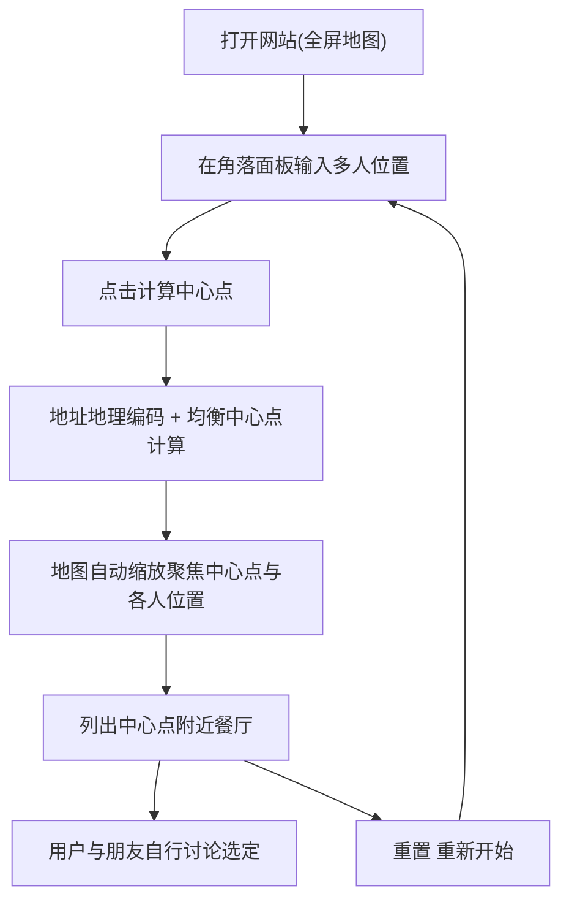

# 聚餐中点选址工具 - 产品需求文档(PRD)

## 1. 产品概述
一个帮助多人聚餐时快速找到"公平聚会点"的 Web 网站。
- 解决朋友们分散居住在城市各处、靠人工比对距离选餐厅效率低的痛点,自动计算一个到每个人公共交通通勤时间尽量均衡的中心点,并列出该点附近的餐厅供大家讨论。
- 面向国内日常社交聚会场景,核心价值在于"均衡选址",而非替用户决策选哪家店。

## 2. 核心功能

### 2.1 用户角色
本产品为无需登录的轻量工具,所有访客权限一致,无角色区分。

### 2.2 功能模块
1. **主页面(地图工作台)**:全屏地图背景、位置输入面板、计算控制、中心点结果展示、附近餐厅列表。

### 2.3 页面详情
| 页面名称 | 模块名称 | 功能描述 |
|---------|---------|---------|
| 主页面 | 全屏地图背景 | 以高德地图作为整个页面的大背景铺满视口;支持鼠标滚轮上下滚动放大/缩小;支持拖拽平移 |
| 主页面 | 位置输入面板 | 叠加在地图角落的半透明面板;默认提供 2 个输入框,每个框对应一个人的位置;支持"添加一行/删除一行"动态增减人数(2-6 人);输入框带高德地址联想/自动补全 |
| 主页面 | 计算控制 | "计算中心点"按钮;点击后对所有有效地址做地理编码,计算到各人通勤时间最均衡的中心点;计算中显示加载状态 |
| 主页面 | 中心点结果展示 | 计算完成后在地图上以不同样式标注每个人的位置标记与最优中心点标记;地图自动缩放并平移,使所有标记点与中心点都在可视范围内聚焦;展示中心点到每个人的预计通勤时间 |
| 主页面 | 附近餐厅列表 | 在中心点周边搜索餐厅 POI;以列表形式列出(店名、菜系分类、人均价格、距中心点距离/步行分钟、高德基础评分);默认按距中心点由近到远排序;明确只罗列不替用户推荐;点击某条餐厅在地图上高亮对应标记 |
| 主页面 | 重置 | 清空所有输入与标记,地图恢复初始视图 |

## 3. 核心流程
用户打开网站看到全屏地图 → 在角落面板依次输入自己和朋友的位置(可增减输入框)→ 点击"计算中心点" → 系统对各地址地理编码并计算通勤最均衡的中心点 → 地图自动缩放聚焦到中心点与所有人位置 → 下方/侧边列出中心点附近的餐厅 → 用户与朋友自行浏览讨论选定餐厅。

## 4. 用户界面设计

### 4.1 设计风格
- 整体风格:极简、克制,弱化界面、强化地图本身,让地图成为主角。
- 主色:深墨绿/青灰作为品牌色,搭配暖白与一处明亮强调色(如琥珀橙)用于中心点标记与主按钮。
- 控件:叠加在地图上的浮层面板使用毛玻璃(半透明 + 模糊)效果,圆角卡片,轻投影。
- 按钮:圆角实心主按钮(计算),次级为描边/幽灵按钮(添加、重置)。
- 字体:标题使用具个性的显示字体,正文使用清晰易读的无衬线字体(避免 Inter/Arial 等通用字体)。
- 图标:简洁线性图标;不同人的位置标记用编号 + 不同色点,中心点用强调色的独特标记区分。

### 4.2 页面设计概览
| 页面名称 | 模块名称 | UI 元素 |
|---------|---------|---------|
| 主页面 | 全屏地图背景 | 地图铺满视口,作为唯一背景层;所有控件浮于其上 |
| 主页面 | 位置输入面板 | 左上或右上角毛玻璃卡片;编号输入框列表;加号/减号增减行;主按钮"计算中心点" |
| 主页面 | 中心点 & 标记 | 各人编号色点标记 + 中心点强调色标记;计算后带轻微落点动画;自动 fitView 聚焦 |
| 主页面 | 餐厅列表 | 半透明面板内的可滚动卡片列表;每张卡片含店名/菜系/距离/评分;hover 高亮;点击联动地图标记 |

### 4.3 响应式
桌面优先。移动端自适应:浮层面板在窄屏下改为底部可上拉抽屉,输入与餐厅列表分区切换,保证触摸操作友好。

## 5. 备注与已知约束
- 餐厅评价数据:大众点评/美团无公开 API,MVP 阶段餐厅信息(评分、菜系、人均)使用高德地图 POI 自带数据。
- 中心点算法:MVP 采用"几何质心 + 候选点公交时间均衡打分"的简化策略,优先保证可用与体验;后续可迭代为等时圈交集等更精确方案。
- 网站只负责"选址 + 列出餐厅",不替用户自动选定具体餐厅。
