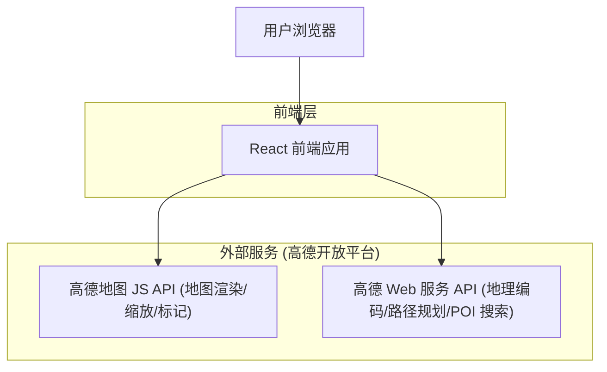

# 聚餐中点选址工具 - 技术架构文档

## 1. 架构设计



说明:本产品为纯前端单页应用,不需要自建后端与数据库。所有地理能力直接调用高德开放平台。为隐藏 Key 与规避浏览器跨域/配额暴露,生产环境可后续补一层轻量代理,MVP 阶段先用高德 JS API + 安全密钥方案在前端直连。

## 2. 技术说明
- 前端:React@18 + tailwindcss@3 + vite
- 初始化工具:vite-init
- 地图与地理服务:高德地图 JS API 2.0 + 高德 Web 服务 API(地理编码、公交路径规划、周边 POI 搜索)
- 状态管理:React 内置 hooks(useState/useReducer),无需引入额外状态库
- 后端:无
- 数据库:无(餐厅与位置数据实时来自高德,无需持久化)
- 配置:高德 Key 通过 `.env` 环境变量注入(`VITE_AMAP_KEY`、`VITE_AMAP_SECURITY_CODE`);未配置 Key 时启用本地 mock 数据,保证原型可直接运行预览

## 3. 路由定义
| 路由 | 用途 |
|------|------|
| / | 主页面:全屏地图工作台,包含位置输入、计算、中心点与餐厅列表全部功能 |

## 4. 关键模块与数据结构(前端)

核心数据类型(TypeScript 描述):

```text
Person {
  id: string          // 行标识
  label: string       // 显示编号/名称, 如 "我" "朋友1"
  address: string     // 用户输入的地址文本
  location?: [number, number]  // 经纬度, 地理编码后填充
}

CenterResult {
  center: [number, number]      // 计算出的最优中心点经纬度
  durations: number[]           // 中心点到每个人的预计通勤时间(秒/分钟)
}

Restaurant {
  id: string
  name: string
  category: string    // 菜系分类
  avgPrice?: number   // 人均
  rating?: number     // 高德基础评分
  distance: number    // 距中心点距离(米)
  location: [number, number]
}
```

## 5. 中心点计算逻辑(前端算法,MVP)
1. 对每个 Person 的 address 调用高德地理编码,得到经纬度。
2. 计算所有点的几何质心,作为初始候选中心。
3. 在质心周围按同心圆/网格生成若干候选点。
4. (可选/分阶段)对候选点调用高德公交路径规划,计算每人到候选点的通勤时间。
5. 打分:选取"各人通勤时间方差最小(最均衡)"的候选点作为最终中心点。
6. 以最终中心点调用高德周边搜索(类型:餐饮),返回餐厅列表。
7. 地图调用 setFitView 将所有人标记与中心点纳入视野并聚焦。

成本优化:候选点先用直线距离粗筛,仅对少量优选候选点调用真实公交路径规划,降低 API 调用量。

## 6. 错误与降级处理
- 地址无法解析:在对应输入框提示"未找到该地址",不阻断其他人的计算。
- 高德 Key 未配置或请求失败:自动降级为内置 mock 数据(预置示例坐标与餐厅),保证原型可演示。
- 有效地址少于 2 个:禁用"计算中心点"按钮并提示。
